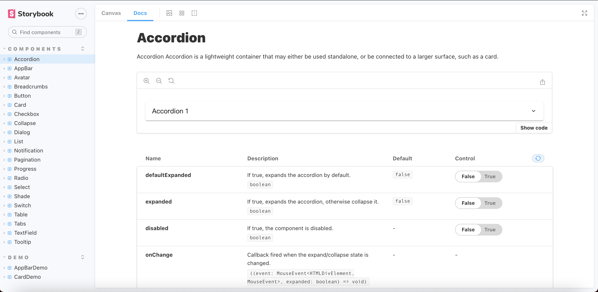
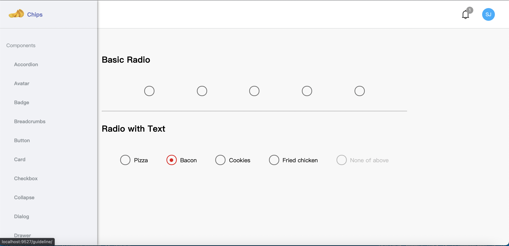

# Material-ui-clone

Build a React UI library clone from material UI





## Installation

```shell
$ git clone https://github.com/ChaoTzuJung/material_ui_clone.git
$ cd material_ui_clone
$ yarn install && yarn run dev
open web -> http://localhost:9527/
open storybook -> http://localhost:6006/
```

## Todo Roadmap

### Component

- [ ] Autocomplete
- [x] Accordion
- [ ] Alert
- [x] AppBar
- [x] Avatar
- [ ] Backdrop
- [ ] Bottom Navigation
- [x] Breadcrumbs
- [x] Button
- [ ] Button group
- [x] Card
- [x] Checkbox
- [ ] Chip
- [x] Collapse
- [ ] Date Picker
- [ ] Date Range Picker
- [ ] Date Time Picker
- [x] Dialog
- [ ] Divider
- [ ] Floating action button
- [ ] Icons
- [ ] Image list
- [x] List
- [ ] Links
- [ ] Masonry
- [ ] Menu
- [x] Notification
- [x] Pagination
- [ ] Paper
- [x] Progress
- [x] Radio
- [ ] Rating
- [x] Select
- [ ] Skeleton
- [ ] Slider
- [ ] Snackbar
- [ ] Speed Dial
- [ ] Stepper
- [x] Switch
- [x] Table
- [x] Tabs
- [x] TextField
- [ ] Timeline
- [ ] Time Picker
- [ ] Toggle Buttons
- [x] Tooltip
- [ ] TTransfer List
- [ ] Tree View
- [ ] Typography

### Featrure

- [ ] Dark Mode
- [ ] Use styled-components

## Application structure

```
├── .storybook/
│  ├── main.js              [Storybook 主要的組態設定檔案]
│  └── preview.js           [storybook 網頁的項目組態設定]
src/
├── assets/
├── docs/                   [文件、style guides]
├── common/                 [應用級別的通用元件]
├── containers(or pages)/
|   ├── feature1/
|   |   ├── components/     [功能拆分出的專用元件]
|   |   └── feature1.tsx    [容器元件]
├── helpers(or lib)/        [純資料邏輯處理相關、middleware]
│   ├── middleware.ts
│   └── utils.ts
├── Interface/
├── mocks/                  [fake Api 相關]
├── redux(os store)/        [其實還沒仔細研究，之後再規劃]
|   ├── index.ts            [combineReducers]
|   ├── module1.ts          [reducer, action types, actions creators]
|   └── module2.ts          [reducer, action types, actions creators]
├── routes/
│   └── index.ts
└── index.tsx
├── stories/                [storybook component 相關的所有資料]
│   └── assets              [storybook component 圖片]
```

reference：

- [談大型 React app 檔案架構](https://medium.com/frochu/large-react-app-file-structure-b8be5b1329df)
- [如何組織你的 React Redux 的檔案架構](https://medium.com/@as790726/%E5%A6%82%E4%BD%95%E7%B5%84%E7%B9%94%E4%BD%A0%E7%9A%84-react-redux-%E7%9A%84%E6%AA%94%E6%A1%88%E6%9E%B6%E6%A7%8B-e000a1afdd1)
- [Babel 筆記 (7.7.0 之後)](https://hsuehyungtan.medium.com/babel-%E7%AD%86%E8%A8%98-7-7-0-5274be4eed93)

## 開發環境

- node v14.16.1 (lts/fermium)
- React 17
- Webpack 5
- Babel 7
- eslint 7
- husky 4
- editorconfig
- storybook version 6.3.0

---

- 排版工具 Prettier plugin
  - html
  - style
  - ts/tsx/js/jsx
  - json
